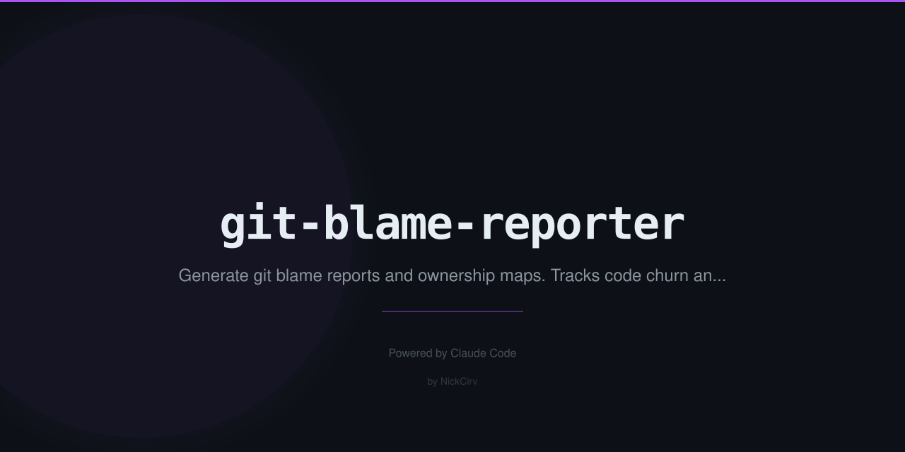

# git-blame-reporter
> Who wrote this mess? Ownership maps, churn kings, and dev accountability reports.

```bash
npx git-blame-reporter
```

```
git-blame-reporter · 142 files analyzed
━━━━━━━━━━━━━━━━━━━━━━━━━━━━━━━━━━━━━━

👑 Code Ownership
  Nick      48%  ████████████░░░  63 files
  Sarah     31%  ████████░░░░░░░  41 files

🔥 Churn Kings
  James   89% churn  "The Ghost Writer"
  Sarah   18% churn  "Immortal"

🎖 Labels
  Nick  → Code Hoarder (44% of files)
  Sarah → Immortal (avg 8.3 month code age)

━━━━━━━━━━━━━━━━━━━━━━━━━━━━━━━━━━━━━━
```

## Commands
| Command | Description |
|---------|-------------|
| `git-blame-reporter` | Full blame analysis |
| `--author <name>` | Focus on one contributor |
| `--file <path>` | Blame a specific file |
| `--top N` | Top N contributors |

## Install
```bash
npx git-blame-reporter
npm install -g git-blame-reporter
```

---
**Zero dependencies** · **Node 18+** · Made by [NickCirv](https://github.com/NickCirv) · MIT
